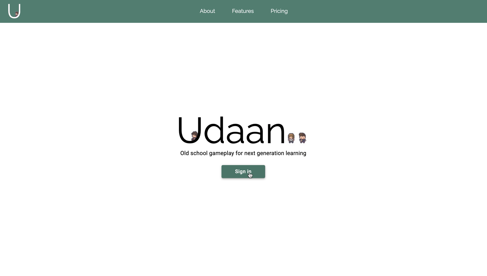
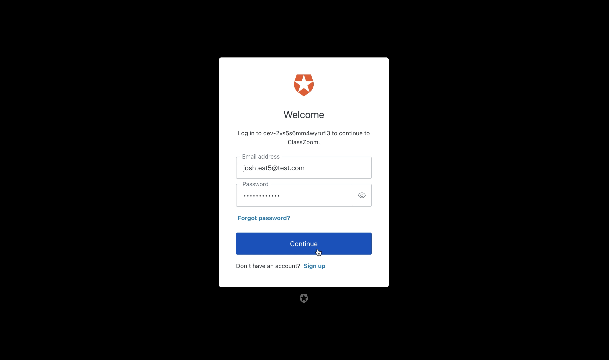
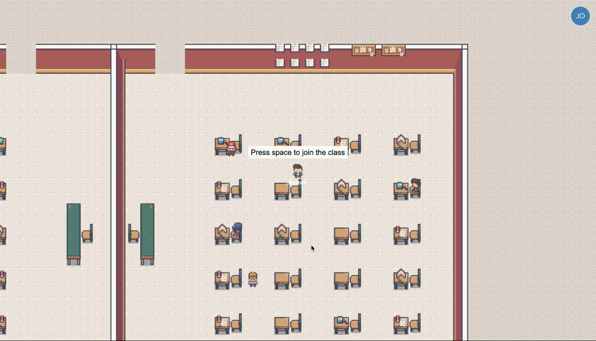
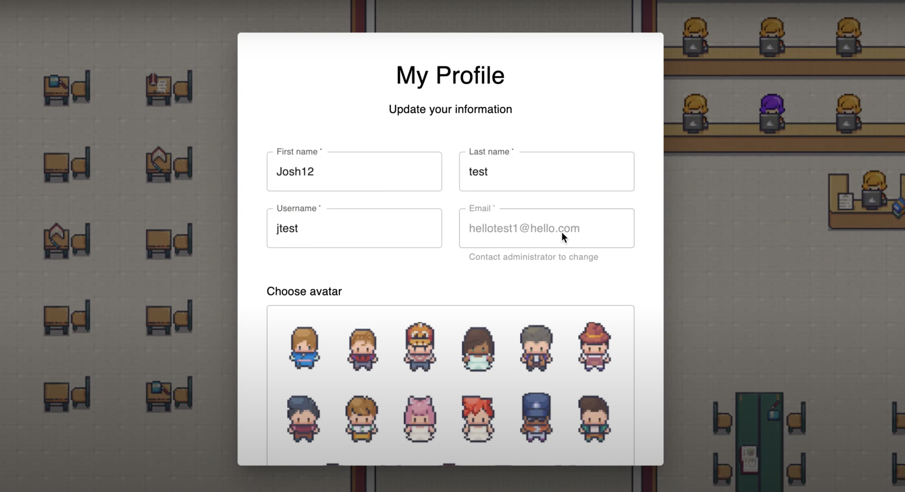
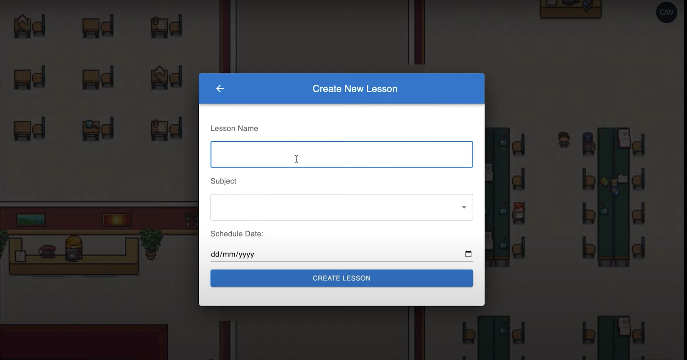
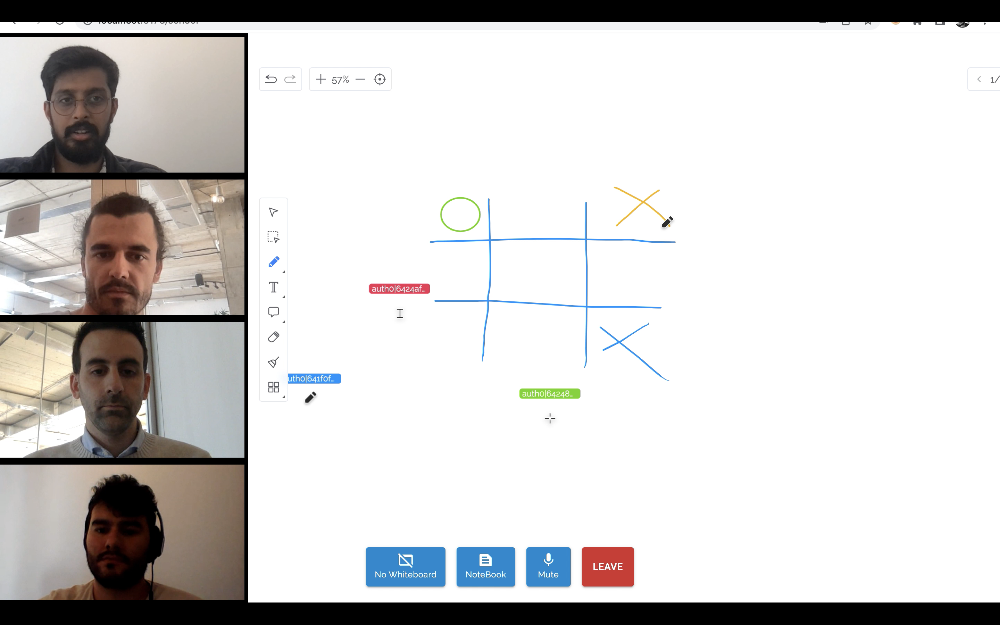
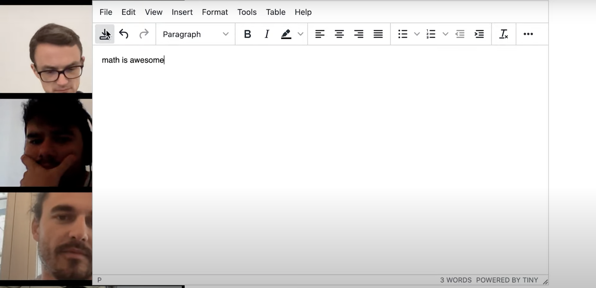
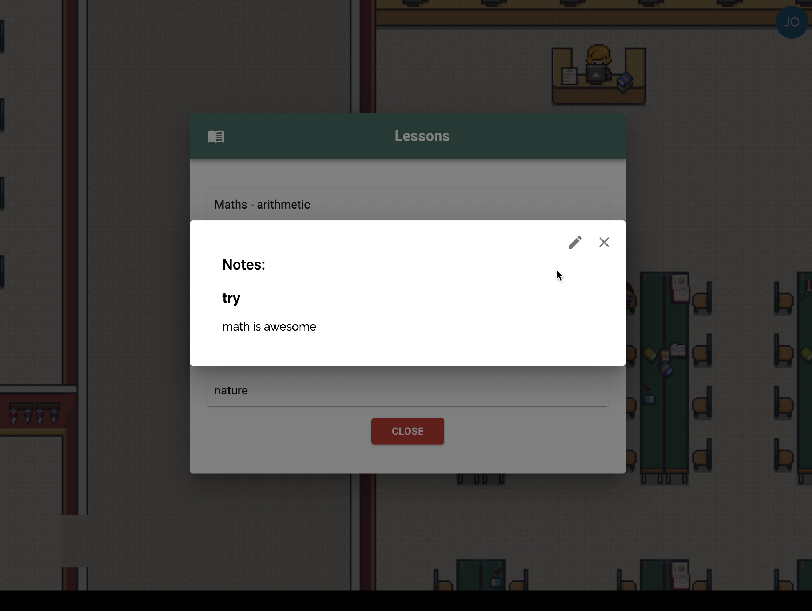

<div align="center">
  
</div>
<p>
Udaan is a tool built for schools to help create,organise and conduct online lessons for their students while keeping them engaged. It makes distance learning more immersive by providing them with a custom built arcade virtual school, where students can attend classes as customisable characters and access their lessons from the library, while the teachers are provided with highly intuitive educational tools to make their lives easier.
</p>

## Table of Contents

- [Tech Stack](#tech-stack)
- [Features](#features)
- [Getting Started](#getting-started)
  - [Prerequisites](#prerequisites)
  - [Installation](#installation)
- [Contributing](#contributing)
- [License](#license)

## Tech Stack

- [Typescript](https://www.typescriptlang.org/)
- [React](https://react.dev/)
- [Redux](https://redux.js.org/)
- [Phaser](https://phaser.io/)
- [Colyseus](https://www.colyseus.io/)
- [Node.js](https://nodejs.org/en/docs)
- [Express](https://expressjs.com/)
- [postgreSQL](https://www.postgresql.org/)
- [Prisma](https://www.prisma.io/)
  <br/>

## Features

Secure login for students and teachers.
<br/>
<br/>



Interactive virtual school with multicharacters
<br/>
<br/>



Ability to Create lessons and conduct them using interactive white boards
<br/>
<br/>



Ability to take down notes and review them later
<br/>
<br/>



## Getting Started

### Prerequisites

- Node.js
- npm
- Postgres

### Installation

1. Clone the repository

   git clone

2. Install dependencies:

3. setup env variables:

4. Start the server:

## Contributing

Udaan is an open-source application and every contribution is welcome.

## License

## Development

### Getting started

- From `/` run `npm run install-all-deps` to install all dependecies
- Create `.env` files in `/server` and `/client` (see examples `.env-example`)
- Start: From `/` run dev environment: `npm run dev`
- Database UI: From `/` run `npm run db-ui`

### Git

- Commit with [Commitizen](https://commitizen-tools.github.io/commitizen/)

## Development

### Git

#### Commit

Run linter followed by `git cz`

```
npm run commit
```

#### BackEnd

In `/server`:

```
npx ts-node dataGenerate.ts
```

Runs the file and create a mock data on database

```
npm start
```

Runs `tsc -w` and `nodemon` at the same time.

#### linter

Run lint checker on `/server` and `/client`

```
npm run lint
```

Run lint checker on `/server`

```
npm run lint:server
```

Run lint checker on `/client`

```
npm run lint:client
```

##### Fix

Fix linting issues `/server` and `/client`

```
npm run lint:fix
```

Fix linting issues on `/server`

```
npm run lint:fix:server
```

Fix linting issues on `/client`

```
npm run lint:fix:client
```
